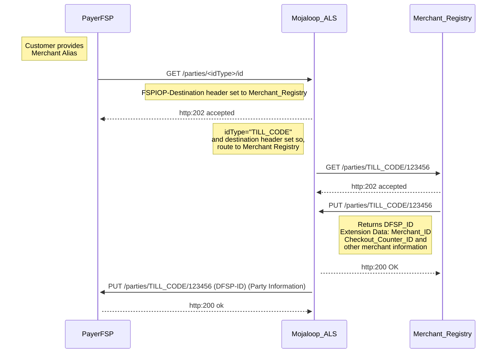

```mermaid

sequenceDiagram

    note left of PayerFSP:Customer provides<br/>Merchant Alias
    PayerFSP->>+Mojaloop_ALS: GET /parties/<idType>/id
    note left of Mojaloop_ALS: FSPIOP-Destination header set to Merchant_Registry
    Mojaloop_ALS-->>+PayerFSP: http:202 accepted
    note left of Mojaloop_ALS: idType="TILL_CODE"<br/> and destination header set so, <br/>route to Merchant Registry
    Mojaloop_ALS->>+Merchant_Registry: GET /parties/TILL_CODE/123456
    Merchant_Registry-->>+Mojaloop_ALS: http:202 accepted
    Merchant_Registry->>+Mojaloop_ALS: PUT /parties/TILL_CODE/123456
    note left of Merchant_Registry: Returns DFSP_ID<br/>Extension Data: Merchant_ID<br/>Checkout_Counter_ID and <br/> other merchant information
    Mojaloop_ALS-->>+Merchant_Registry: http:200 OK
    Mojaloop_ALS->>+PayerFSP: PUT /parties/TILL_CODE/123456 (DFSP-ID) (Party Information)
    PayerFSP-->>+Mojaloop_ALS: http:200 ok
```