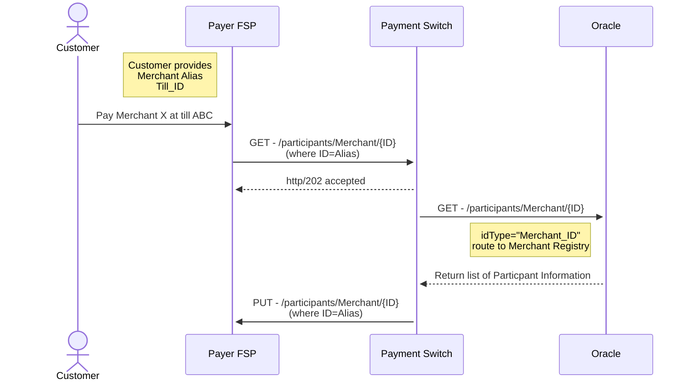

---  
sidebar_position: 2  
sidebar_label: register_merchant
title: Register Merchant
date: 2023-06-21 14:53:33
author: Rob Reeve
description: high level overview of the process to get participants to pay merchant
---  

## Merchant Acquiring to Oracle

The following is the sequence that shows how the Merchant Registry would be used in a basic flow

