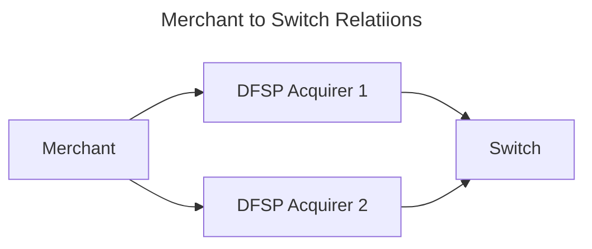

---  
sidebar_position: 2  
sidebar_label: register_merchant
title: Register Merchant
date: 2023-06-01 09:53:33
author: Rob Reeve
description: high level overview of the process to register a merchant
---  

## Merchant Acquiring to Oracle



## DFSP onboarding their merchant and assign an alias  

A DFSP will onboard their Merchant into a Central Merchant Registry via API/portal interface. The expectation is that this flow will also capture all the relevant information required to acquire the merchant.

The working assumption is that the merchant Know your Business (KYB) process is manual, however the system can consider this being done automatically in a future iteration

> It is worth highlighting the anticipated payment flow would have potentially two parts for a payment - the first step capturing the merchant alias (for all merchants), the second capturing the final till to allow for payment reconciliation (for merchants that have more than one payment point). The actual detail of these flows will be covered in other stories, but it is highlighted to point out that the Merchant Registry will use the Merchant ID and the information to support reconciliation (```Till_ID```) will be part of the transaction, but not relevant to the Switch.

Once the merchant or the DFSP has registered the information in the Acquirer system, it can then be passed to the Merchant Registry, where an alias will be validated or created


## DFSP onboarding their merchant and reuse an alias  

## Medium Merchant

aliases

## Complex Merchant

aliases
