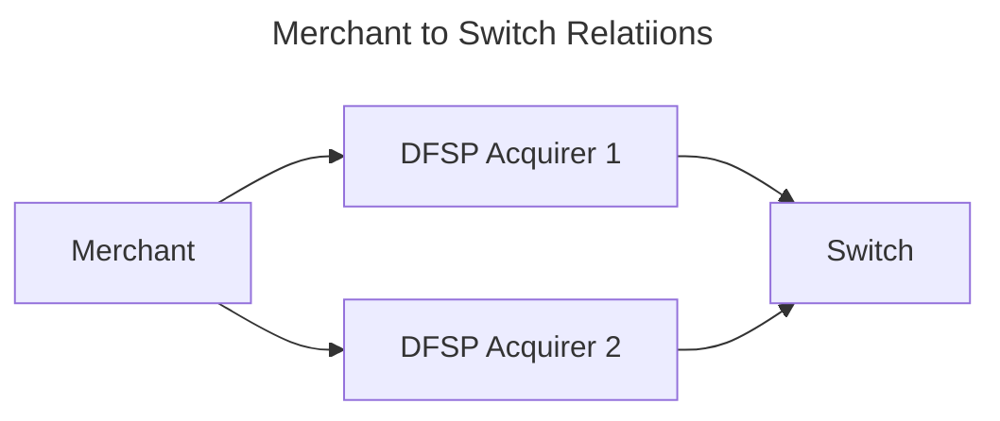
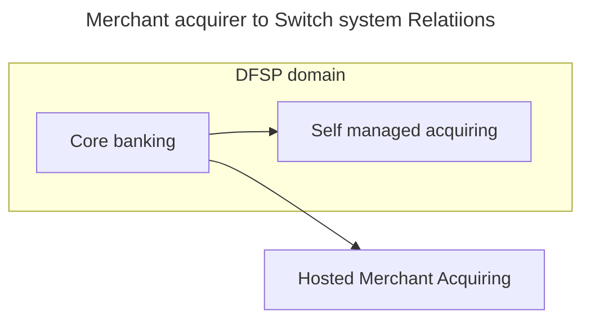
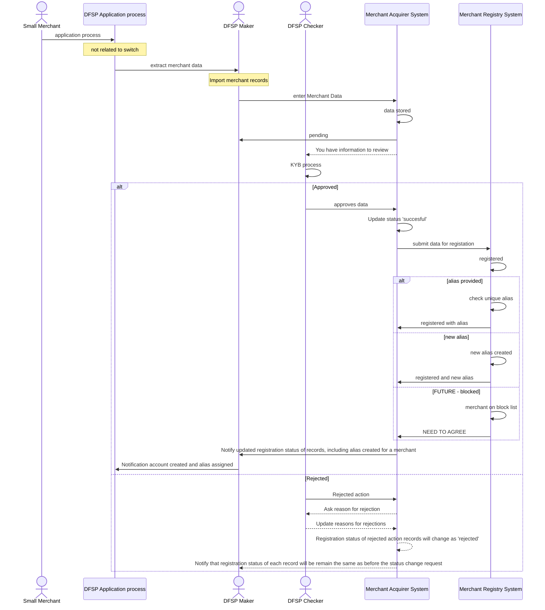

---  
sidebar_position: 2  
sidebar_label: register_merchant
title: Register Merchant
date: 2023-06-01 09:53:33
author: Rob Reeve
description: high level overview of the process to register a merchant
---  

## Merchant Acquiring to Oracle



A merchant should be given the flexibility to have more than one DFSP acquiring them - to provide resiliency, and commercial leverage.



The above diagram identifies the different models we need to consider in the creation of a service. A merchant acquirer might have its own services, which simplifies the interaction with the switch as it should all happen with the DFSP domain.

The design needs to consider how information from the Hosted Merchant Acquiring is provided back to the DFSP so they can 

## Overview

The onboarding of a merchant in to the merchant registry, means that they are first acquired (or accepted) by a Digital Financial Service Provider (DFSP). We achieve this in different ways, we cover these in the following documentation.

- DFSP onboards merchant entering data in to the portal
- DFSP onboards merchant in their own system and shares the information with the Merchant registry.
- Merchant self registration (they enter their details in to a scheme portal and then enter a portal to be acquired by DFSP(s))

As a DFSP may not have an acquiring system, this document covers onboard by a DFSP in a portal first. 

## DFSP onboarding their merchant and assign an alias  

A DFSP will onboard their Merchant into a Central Merchant Registry via API/portal interface. The expectation is that this flow will also capture all the relevant information required to acquire the merchant.

The working assumption is that the merchant Know your Business (KYB) process is manual, the system can consider this could be done automatically in a future iteration

> It is worth highlighting the anticipated payment flow would have potentially two parts for a payment - the first step capturing the merchant alias (for all merchants), the second capturing the final till to allow for payment reconciliation (for merchants that have more than one payment point). The actual detail of these flows will be covered in other stories, but it is highlighted to point out that the Merchant Registry will use the Merchant ID and the information to support reconciliation (```CheckoutCounterID```) will be part of the transaction, but not relevant to the Switch.

Once the merchant or the DFSP has registered the information in the Acquirer system, the portal passes the necessary information to the Merchant Registry, where an alias is either validated or created



## DFSP onboarding their merchant and reuse an alias  

## Medium Merchant

aliases

## Complex Merchant

aliases
