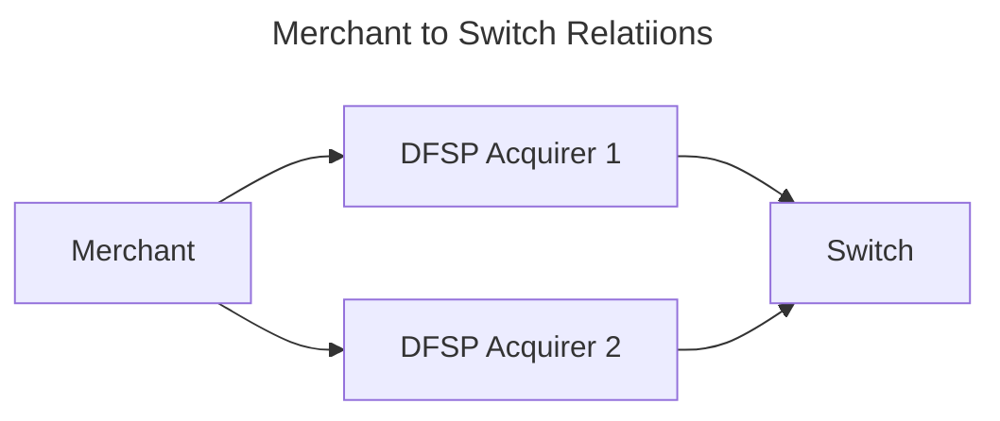
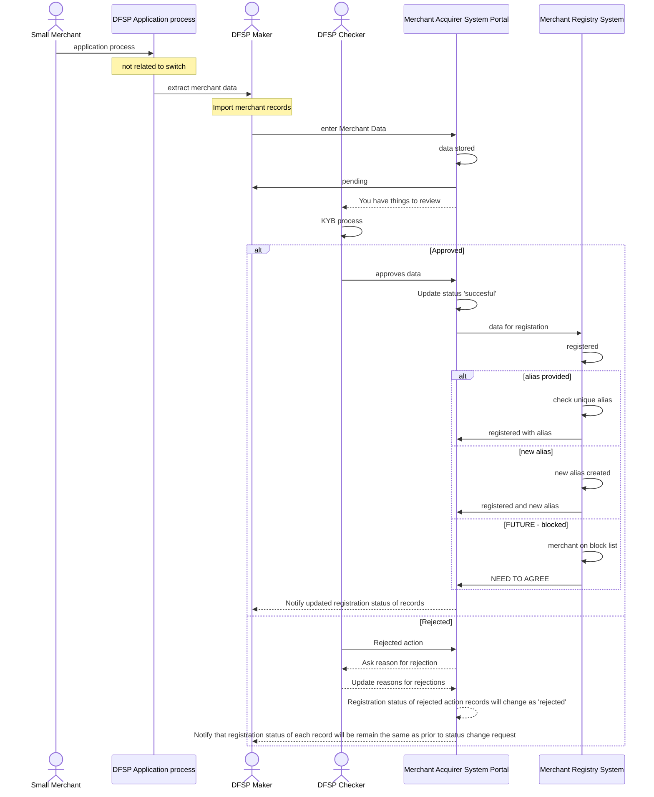

---  
sidebar_position: 2  
sidebar_label: register_merchant
title: Register Merchant
date: 2023-06-01 09:53:33
author: Rob Reeve
description: high level overview of the process to register a merchant
---  

## Merchant Acquiring to Oracle

## DFSP onboarding their merchant and assign an alias  

DFSP onboard their Merchant into Central Merchant Registry via API/portal interface

Working assumption for now is that the merchant KYB process is manual, however the system can consider this being done automatically

## DFSP onboarding their merchant and reuse an alias  

## Medium Merchant

aliases

## Complex Merchant

aliases
