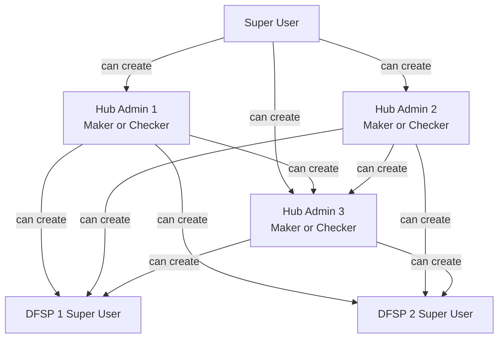
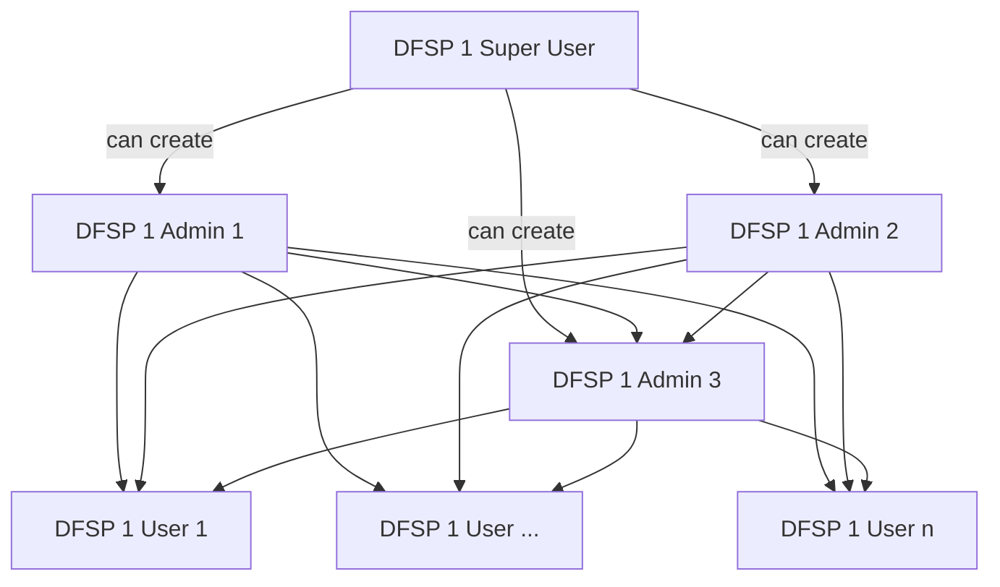

# Hierearchy of Users

To create users and subsequent groups in a multi-tenant scenario, the goal is to reduce the administrative burden of Hub Admins, and allow the users to be self sufficient

The creation of each of the Super Users should be supported by a documented approval process, to prevent authority being granted inadvertently.

## Super Users  

Once a Super User has been created, they can create only three Hub admin accounts. Once three Hub Admin accounts have been created, the SuperUser is disabled

## Hub Admin Users

Once a Hub Admin has been created they can create other Hub Admins or a DFSP super user and assign that user account to a specific DFSP and the groups it manages. Each user creation will have a maker and checker step

## DFSP Admin Users

It is worth noting that a DFSP Admin can only assign membership to groups of that DFSP

