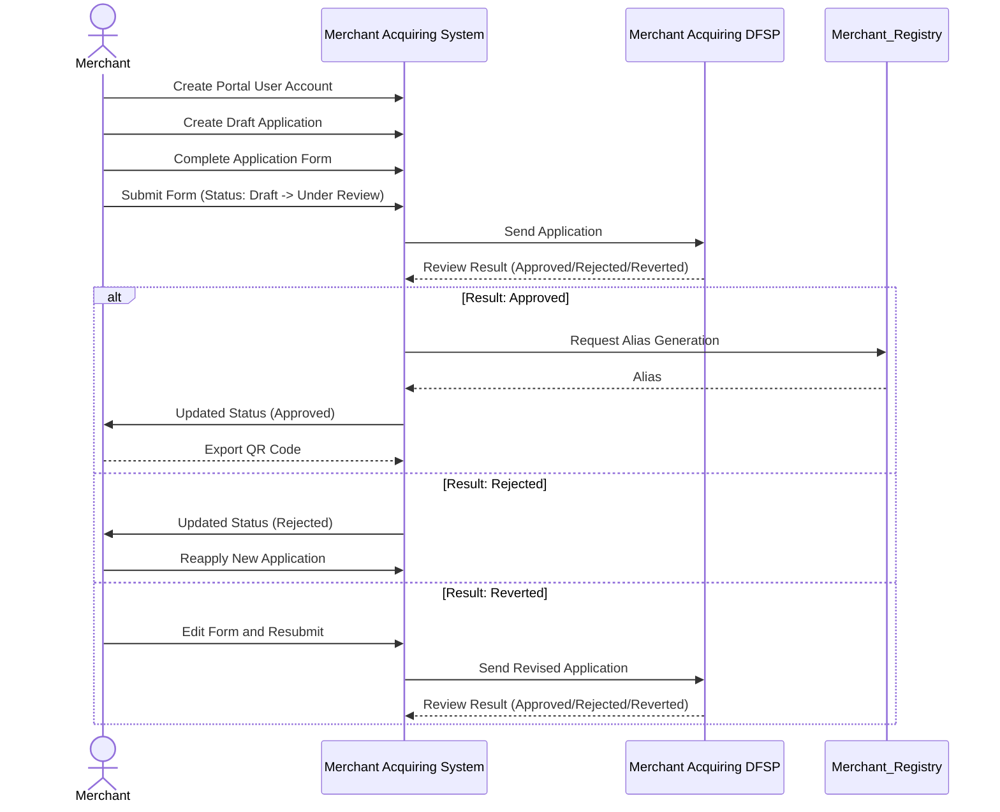

```mermaid
sequenceDiagram

    actor M as Merchant
    participant  MAS as Merchant Acquiring System
    participant MADFSP as Merchant Acquiring DFSP
    participant MR as Merchant_Registry

    M->>MAS: Create Portal User Account
    M->>MAS: Create Draft Application
    M->>MAS: Complete Application Form
    M->>MAS: Submit Form (Status: Draft -> Under Review)
    MAS->>MADFSP: Send Application
    MADFSP-->>MAS: Review Result (Approved/Rejected/Reverted)
    
    alt Result: Approved
        MAS->>MR: Request Alias Generation
        MR-->>MAS: Alias
        MAS->>M: Updated Status (Approved)
        M-->>MAS: Export QR Code
    else Result: Rejected
        MAS->>M: Updated Status (Rejected)
        M->>MAS: Reapply New Application
    else Result: Reverted
        M->>MAS: Edit Form and Resubmit
        MAS->>MADFSP: Send Revised Application
        MADFSP-->>MAS: Review Result (Approved/Rejected/Reverted)
    end
```
