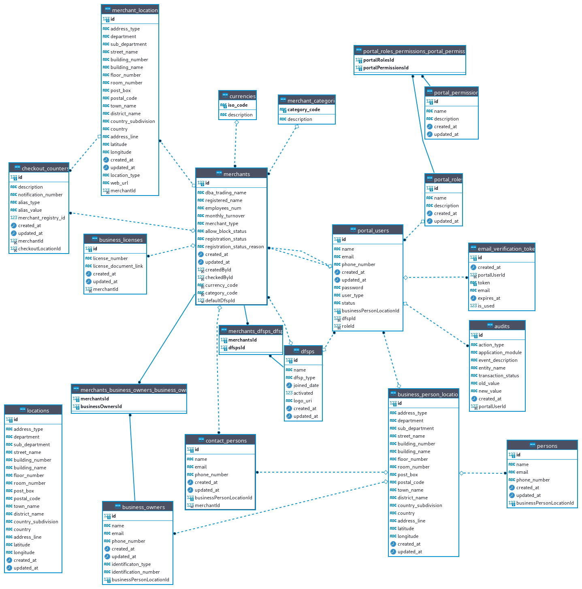

# Merchant Registry System

This repository is dedicated to the documentation of a merchant payment system using Mojaloop for seamless merchant transactions. The system allows consumers to pay merchants using mobile wallets with interoperability.

In this current phase, we are focused on implementing the acquiring system and merchant registry, which will serve as an oracle in the payment process.

The Mojaloop's Account Lookup Service will interact with the merchant registry and proceed with the necessary steps in the payment transaction.

#### For the development repository
[Merchant Payment Development Repository](https://github.com/mojaloop/merchant-registry-svc)

## Feature Summary

### First Sprint Features
* Login
    * This is simple login flow by using email and password.
* Registry Form
    * This feature is for registering a simple merchant to the acquirer system. 
* Registration Save As Draft Feature
    * This feature allows you to save an application form that is still in process as a draft.
* Registry form records reports
    * This feature is for showing relevant reports that include data from users' own organizations.
    * DFSP maker can view all merchant records that are already successfully registered and those that were approved or rejected by DFSP checker.
    * DFSP checker can view all merchant records that have already been successfully registered, and he can approve or reject the records that the maker added.
* [For More Detail](https://github.com/mojaloop/merchant-payment-docs/tree/First-Sprint-Features-Requirements/First%20Sprint%20Features/priority%20list)

### Second Sprint Features
* Draft Application List
    * This feature is for showing the draft application list in a table and allowing users to reload the work-in-progress of the saved draft form.
* Back and Update Record Feature
    * This feature allows users to edit the data of the previous page of the form by providing a “back” button.
* Report Download
    * This feature is for downloading filtered records from each report based on selected criteria.
* Revert Record Feature
    * This feature allows users to fill out the revert form applications by selecting the one for which new information is received.
* Data Retrieval
    * This feature allows the DFSP checker to review the data that is related to his DFSP to be aware of which records have been approved and which have been rejected.
* [For More Detail](https://github.com/mojaloop/merchant-payment-docs/tree/master/Second%20Sprint%20Features)

### Third Sprint Features
* Portal User Management
    * This feature is for describing the respective permissions for each role in the merchant acquiring system and assigning new users to the different roles.
* [For More Detail](https://github.com/mojaloop/merchant-payment-docs/tree/master/Third%20Sprint%20Features)

### Sprint 4 Features
* Audit Log
    * This feature allows users to access the audit log for a specific DFSP and view a table containing records of actions sorted by the latest updated time.
* Merchant Registry Oracle
* [For More Detail](https://github.com/mojaloop/merchant-payment-docs/tree/master/Sprint-4-features)

### Design File
* [High Fidelity Design in Figma](https://www.figma.com/proto/sEFusJJ4pQedgXvfRixE7b/Merchant-Registry-Prototype?page-id=1435%3A7881&type=design&node-id=1517-10353&viewport=291%2C3408%2C0.34&t=geOa0rm3lNlsrrjb-1&scaling=scale-down&starting-point-node-id=1517%3A10353&show-proto-sidebar=1&mode=design)

## QA Test Case Results
* [Final Result for first sprint and second sprint](https://docs.google.com/spreadsheets/d/1piKniAwkdBTP5Vgk1KH5ERYXyUujrHVLQ2j_Fz9fQm8/edit?usp=sharing)
* [Final Result for third sprint](https://docs.google.com/spreadsheets/d/1Kv1YHTfS8JW4gBPKd-ZvQmWiMfgl2OmNsiwd9Ux9ls0/edit?usp=sharing)

## Some features that can be added in future
* Although the development has covered complex merchants according to data structure, it still needs to connect with the UI and backend. Complex merchants mean merchants with multiple locations and multiple check-out counters.
* QR code generation for merchant alias 
* 2 Factor Authentication in merchant acquiring system portal
* Connecting with Keycloak, mojaloop authentication and authorization methods
Bulk data input in merchant acquiring system

## ERD Design

