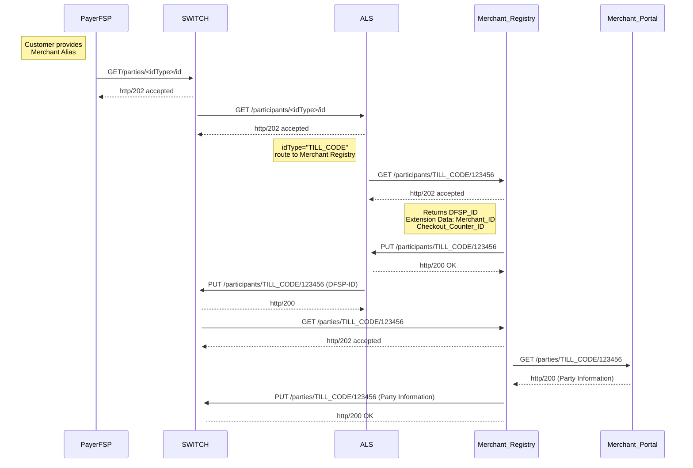

```mermaid
sequenceDiagram

    note left of PayerFSP:Customer provides<br/>Merchant Alias

    PayerFSP->>+SWITCH: GET/parties/<idType>/id

    SWITCH-->>+PayerFSP: http/202 accepted

    SWITCH->>+ALS: GET /participants/<idType>/id

    ALS-->>+SWITCH: http/202 accepted

    note left of ALS: idType="TILL_CODE"<br/>route to Merchant Registry

    ALS->>+Merchant_Registry: GET /participants/TILL_CODE/123456

    Merchant_Registry-->>+ALS: http/202 accepted

    note left of Merchant_Registry: Returns DFSP_ID<br/>Extension Data: Merchant_ID<br/>Checkout_Counter_ID

    Merchant_Registry->>+ALS: PUT /participants/TILL_CODE/123456

    ALS-->>+Merchant_Registry: http/200 OK

    ALS->>+SWITCH: PUT /participants/TILL_CODE/123456 (DFSP-ID)

    SWITCH-->>+ALS: http/200

    SWITCH->>+Merchant_Registry: GET /parties/TILL_CODE/123456

    Merchant_Registry-->>+SWITCH: http/202 accepted

    Merchant_Registry->>+Merchant_Portal: GET /parties/TILL_CODE/123456

    Merchant_Portal-->>+Merchant_Registry: http/200 (Party Information)

    Merchant_Registry->>+SWITCH: PUT /parties/TILL_CODE/123456 (Party Information)

    SWITCH-->+Merchant_Registry: http/200 OK
```