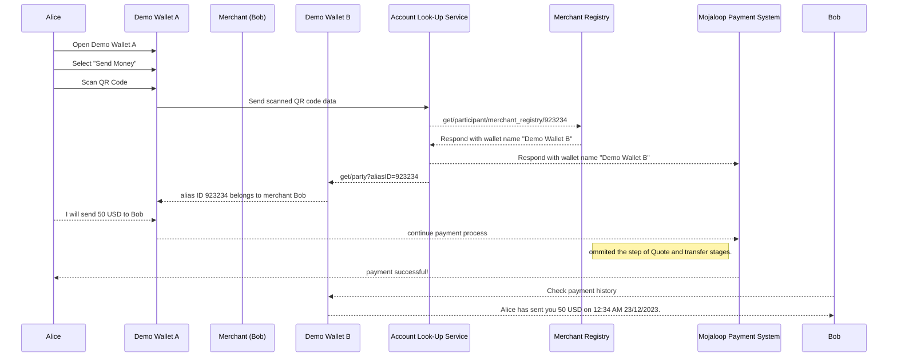
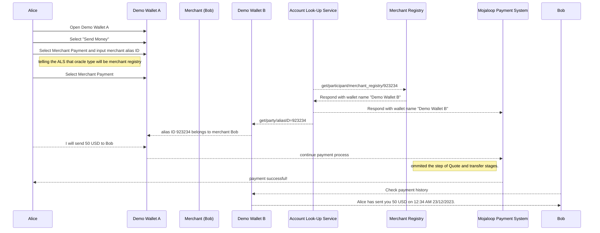

# Merchant Payment user journey

## Use case 1: By scanning QR code to pay

```mermaid

sequenceDiagram
    participant Alice as Alice
    participant WalletA as Demo Wallet A
    participant Merchant as Merchant (Bob)
    participant WalletB as Demo Wallet B
    participant ALS as Account Look-Up Service
    participant MS as Merchant Registry
    participant Mojaloop as Mojaloop Payment System
    
    Alice ->> WalletA: Open Demo Wallet A
    Alice ->> WalletA: Select "Send Money"
    Alice ->> WalletA: Scan QR Code
    
    WalletA ->> ALS: Send scanned QR code data
    
    ALS -->> MS: get/participant/merchant_registry/923234
    MS -->> ALS: Respond with wallet name "Demo Wallet B"
    
    ALS -->>Mojaloop: Respond with wallet name "Demo Wallet B"
    ALS -->>WalletB: get/party?aliasID=923234
    WalletB -->>WalletA: alias ID 923234 belongs to merchant Bob

    Alice -->> WalletA: I will send 50 USD to Bob
    WalletA -->> Mojaloop: continue payment process
     % This is a comment added to this step.
    Note left of Mojaloop: ommited the step of Quote and transfer stages.
    Mojaloop -->>Alice: payment successful!
    Bob -->>WalletB: Check payment history
    WalletB -->>Bob: Alice has sent you 50 USD on 12:34 AM 23/12/2023.
```

## Use case 2: By giving input by selecting merchant payment and merchant alias ID

```mermaid

sequenceDiagram
    participant Alice as Alice
    participant WalletA as Demo Wallet A
    participant Merchant as Merchant (Bob)
    participant WalletB as Demo Wallet B
    participant ALS as Account Look-Up Service
    participant MS as Merchant Registry
    participant Mojaloop as Mojaloop Payment System
    
    Alice ->> WalletA: Open Demo Wallet A
    Alice ->> WalletA: Select "Send Money"
    Alice ->> WalletA: Select Merchant Payment and input merchant alias ID
     % This is a comment added to this step.
    Note left of WalletA: telling the ALS that oracle type will be merchant registry
    Alice ->> WalletA: Select Merchant Payment
    
    ALS -->> MS: get/participant/merchant_registry/923234
    MS -->> ALS: Respond with wallet name "Demo Wallet B"
    ALS -->>Mojaloop: Respond with wallet name "Demo Wallet B"
    ALS -->>WalletB: get/party/aliasID=923234
    WalletB -->>WalletA: alias ID 923234 belongs to merchant Bob

    Alice -->> WalletA: I will send 50 USD to Bob
    WalletA -->> Mojaloop: continue payment process
     % This is a comment added to this step.
    Note left of Mojaloop: ommited the step of Quote and transfer stages.
    Mojaloop -->>Alice: payment successful!
    Bob -->>WalletB: Check payment history
    WalletB -->>Bob: Alice has sent you 50 USD on 12:34 AM 23/12/2023.
```