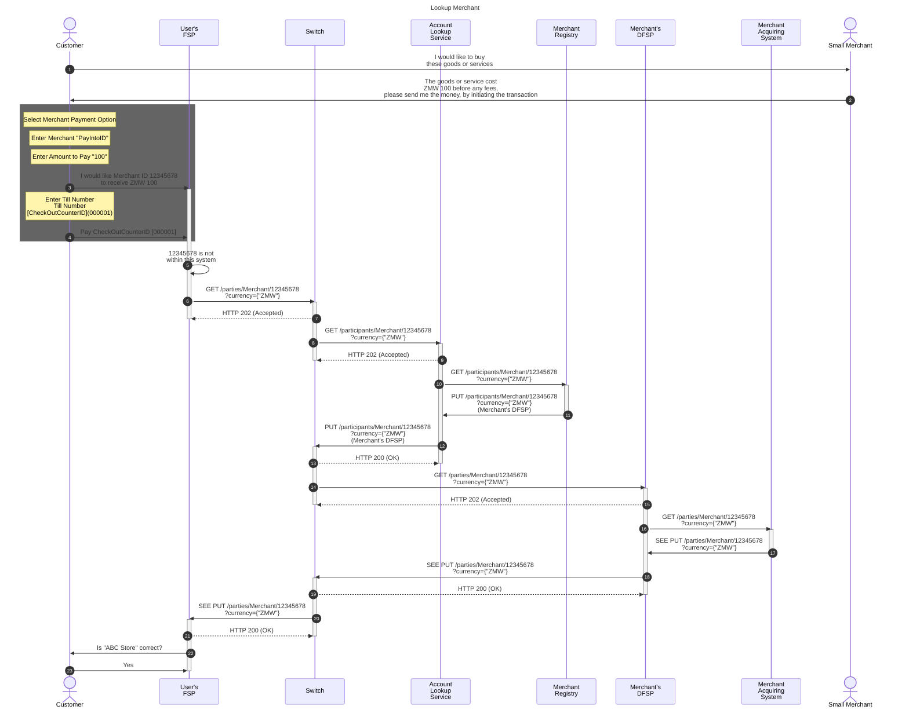
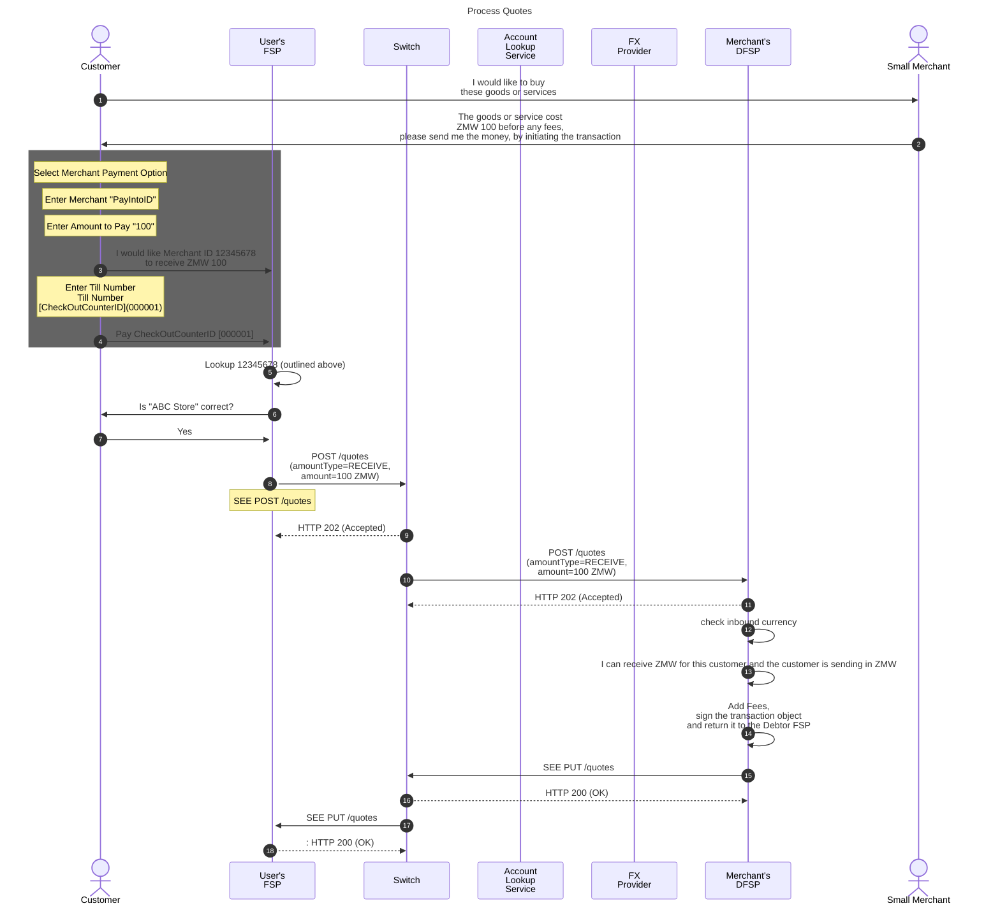
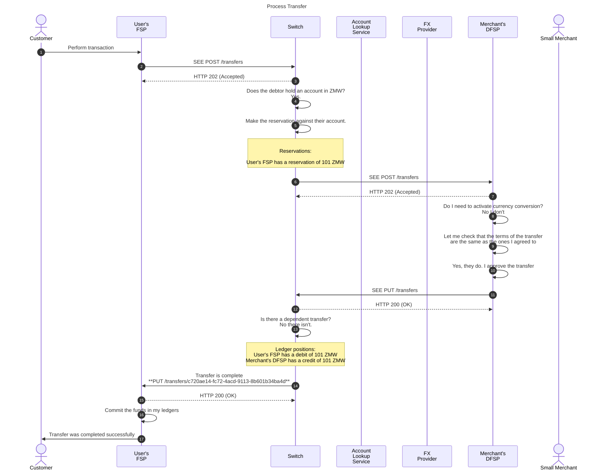
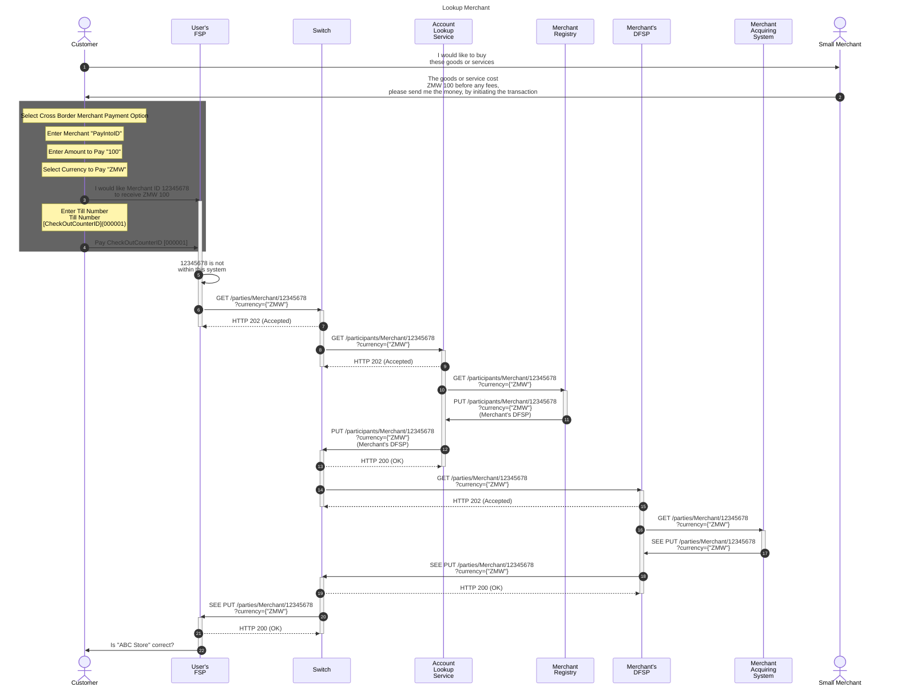
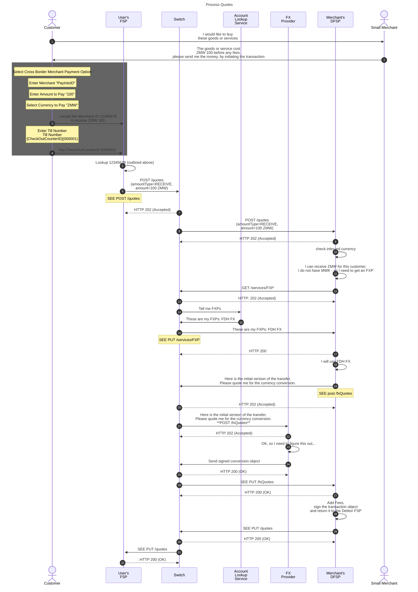
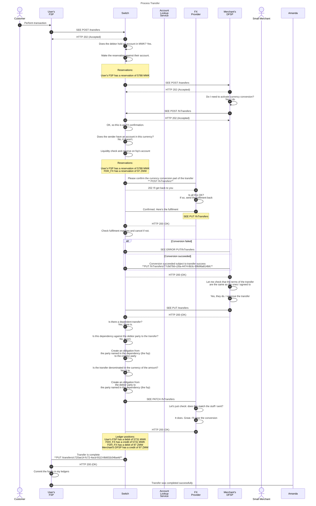

---  
sidebar_position: 2  
sidebar_label: Merchant Payment - Data
title: Data Flows for a Merchant Payment
date: 2023-07-07 09:52:28
author: Rob Reeve
description: flows for a merchant payment
tags: 
---  

## Making a payment to a merchant via USSD (customer initiated)

In the following scenario, we are going to test the boundaries a little, by assuming that the Payment to the merchant will be from a user in one country to a merchant in another country. We provide the data that is needed below and the sequence and the flow of information between the various parties.

The design currently assumes each party has an account identifier that only maps to a single currency. Further design would be required to support an identifier that maps to multiple currencies and any potential resolution that might be required. The receiving DFSP will initiate the conversion of the foreign exchange currency (equally this could be facilitated by the paying DFSP, but this will be explored later).

## Data needed to create a record  

As we are creating a merchant, it's locations and tills, we would need to consider the following data elements

1. PayIntoID (Alias) - 12345678 (system generated or DFSP provided)
1. MerchantID (system) - 87654321 (system generated)
1. Bank Account (not capturing)
1. CheckOut Counter ID - 000001

## Simple - 1 location, 1 counter and same currency Transaction

We will assume our customer and our merchant are in Zambia.

The transaction will be for 100 ZMW.

It is anticipated that a dedicated "merchant payment" could exist in a USSD menu structure.

Depending on the merchant implementation, an additional step of entering the Checkout Counter ID might be required.

As the merchant will be displaying their end price in the transacting currency, it will be necessary to send a "receive" request, to ensure that the merchant gets the price expected, and that the consumer covers the fees. If a send quote is expected, an implementer should consider the merchant impact of the price they quote. (The send quote will lead to a merchant receiving a net amount)

The Merchant FSP will charge 1 ZMW for the merchant transaction.

### Data exposed by Merchant Registry

| Item              | Sample Data    |
| ----------------- | -------------- |
| DFSP ID           | DFSP2          |
| MerchantID        | 87654321       |
| PayIntoID (Alias) | 12345678       |
| Name of Merchant  | ABC Store      |
| Location          | {full address} |
| MobileNumber      |                |

### Data exposed by Payee DFSP

| Item                    | Sample Data            |
| ----------------------- | ---------------------- |
| PayIntoID (Alias)       | 12345678               |
| Pay Into Account Number | PK23HABB12313123121132 |
| CheckOutCounterID       | 000001                 |
| Name of Merchant        | ABC Store              |
| Location                | {full address}         |

### Finding DFSP that maintains this Merchant ID



### PUT /parties/Merchant

```json
PUT /parties
"party"{
    "partyIDInfo": {
        "partyIDType": "Merchant"
        "partyIdentifier": "12345678"
        }
    "name": "ABC Store",
    "receiveCurrencies":[
        "ZMW"
        ]
    "extensionlist": {
        "merchantID": "87654321"
        ,"DBAName": "ABC Store"
        ,"AccountID": "PK23HABB12313123121132"
        ,"location": "{full address}"}

    }
```

### Quotes



### POST /quotes  

```json
POST /quotes

{
    "quoteId": "382987a8-75ce-4037-b500-c475e08c1727"
    ,"transactionId": "d9ce59d4-3598-4396-8630-581bb0551451"
    , "payee": {
        "partyIdInfo": {
        "partyIdType": "MSISDN"
        , "partyIdentifier": "260795390415"
        }
    }
    , "payer": {
        "partyIdInfo": {
            "partyIdType": "MERCHANT"
            , "partyIdentifier": "123456789"
        }
    },
    "amountType": "RECEIVE"
    , "amount": {
        "currency": "ZMW"
        , "amount": "100"
    }
}
```

### PUT /quotes  

```json
put /quotes/382987a8-75ce-4037-b500-c475e08c1727

{
    "transferAmount": {
        "currency": "ZMW"
        , "amount": "101"
    }
    , "payeeReceiveAmount": {
        "currency": "ZMW"
        , "amount": "100"
    },
    "payeeFspFee": {
        "currency": "ZMW"
        , "amount": "1"
    }
    , "expiration": "2021-08-25T14:17:09.663+01:00"
    , "ilpPacket:" {
        "transactionId": "d9ce59d4-3598-4396-8630-581bb0551451"
        , "quoteId": "382987a8-75ce-4037-b500-c475e08c1727"
        , "payee": {
            "partyIdInfo": {
            "partyIdType": "MERCHANT"
            , "partyIdentifier": "87654321"
            }
        }
        , "payer": {
            "partyIdInfo": {
                "partyIdType": "MSISDN"
                , "partyIdentifier": "260795390415"
            }
        }
        , "amount": {
            "currency": "ZMW"
            , "amount": "101"
        }
        , "transactionType": {
            "scenario": "TRANSFER"
            , "initiator": "PAYER"
            , "initiatorType": "CONSUMER"
        }
    }
        , "condition": "BfNFPRgfKF8Ke9kpoNAagmcI4/Hya5o/rq9/fq97ZiA="
    }


```

### Transfer



### POST /transfers

```json
POST /transfers

    {
        "transferId": "c720ae14-fc72-4acd-9113-8b601b34ba4d"
        , "payeeFsp": "Merchant's DFSP"
        , "payerFsp": "User's FSP"
        , "amount": {
            "currency": "MWK"
            , "amount": "5788"
        }
        , "transaction": {
            "transactionId": "d9ce59d4-3598-4396-8630-581bb0551451"
            , "quoteId": "382987a8-75ce-4037-b500-c475e08c1727"
            , "payee": {
                "fspId": "Merchant's DFSP"
                , "partyIdInfo": {
                    "partyIdType": "Merchant"
                    , "partyIdentifier": "87654321"
                    }
            }
        }
        , "payer": {
             "fspId": "User's FSP"
            , "partyIdInfo": {
                "partyIdType": "MSISDN"
                , "partyIdentifier": "265314118010"
            }
        }
    }

```

### PUT /transfers

```JSON  
PUT /transfers/c720ae14-fc72-4acd-9113-8b601b34ba4d

{
    "fulfilment": "mhPUT9ZAwd-BXLfeSd7-YPh46rBWRNBiTCSWjpku90s"
    , "completedTimestamp": "2021-08-25T14:17:08.227+01:00"
    , "transferState": "COMMITTED"
}
```

## Simple - 1 location, 1 counter and a Foreign Exchange Transaction  

We will assume our customer is in Malawi, and our merchant is in Zambia.

The transaction will be for 100 ZMW, with an exchange rate of 1 ZMW equal to 57.31 MWK.

It is anticipated that a dedicated "cross border payment" could exist in a USSD menu structure, and the sender would select the currency that the merchant is accepting.

Depending on the merchant implementation, an additional step of entering the Checkout Counter ID might be required.

As the merchant will be displaying their price in the transacting currency, it will be necessary to send a "receive" request, to ensure that the merchant gets the price expected.

The Merchant FSP will charge 1 ZMW for the merchant transaction.

### Data exposed by Merchant Registry FX

| Item              | Sample Data    |
| ----------------- | -------------- |
| DFSP ID           | DFSP2          |
| MerchantID        | 87654321       |
| PayIntoID (Alias) | 12345678       |
| Name of Merchant  | ABC Store      |
| Location          | {full address} |
| MobileNumber      |                |

### Data exposed by Payee DFSP FX

| Item                    | Sample Data            |
| ----------------------- | ---------------------- |
| PayIntoID (Alias)       | 12345678               |
| Pay Into Account Number | PK23HABB12313123121132 |
| CheckOutCounterID       | 000001                 |
| Name of Merchant        | ABC Store              |
| Location                | {full address}         |

### Finding DFSP that maintains this Merchant ID FX



### PUT /parties/Merchant

```json
PUT /parties
"party"{
    "partyIDInfo": {
        "partyIDType": "Merchant"
        "partyIdentifier": "12345678"
        }
    "name": "ABC Store",
    "receiveCurrencies":[
        "ZMW"
        ]
    "extensionlist": {
        "merchantID": "87654321"
        ,"DBAName": "ABC Store"
        ,"AccountID": "PK23HABB12313123121132"
        ,"location": "{full address}"}

    }
```

### Open Question

- As we have considered a currency selection process we are not considering a merchant account that can receive multiple currencies, nor are we considering a consumer account that can send multiple currencies. Does this create an edge case?

### Quotes with FX



#### Commentary

During the FX Quote, the FXP can add a fee, they will then set an expiry time and sign the quotation object, create an ILP prepare packet and return it in the intermediary object.

> :exclamation: NOTE: the ILP prepare packet contains the following items, all encoded:  
>  
> - The amount being sent (i.e. in the source currency)  
> - An expiry time  
> - The condition  
> - The name of the fxp  
> - The content of the conversion terms  

The Services FXP - will include the desired currency pair in the GET /services/FXP (some currency flows are unidirectional and some require a staging currency). This is not addressed in this document.

When the Payee DFSP receives the Service response, it can request quotes from all parties that provide the service pairs.

The calculations for the FX translation has not yet been validated, as the actual process is still being defined. Therefore all amounts should be checked against the final design, before being used as an example

### PUT /services/FXP

```json
PUT /services/FXP

"fxpProviders":[
    "FDH FX"
    ]
```

### POST /fxQuotes

```json
    {
    "conversionRequestId": "828cc75f-1654-415e-8fcd-df76cc9329b9"
    , "conversion": {
        "conversionId": "581f68ef-b54f-416f-9161-ac34e889a84b"
        , "counterPartyFsp": "FX Provider"
        , "amountType": "RECEIVE"
        , "sourceAmount": {
            "currency": "MWK"
            }
        , "targetAmount": {
            "currency": "ZMW",
            "amount": "100"
            }
        , "validity": "2021-08-25T14:17:09.663+01:00"
        }
    }
```

### PUT /fxQuotes  

```json
    PUT /fxQuotes/828cc75f-1654-415e-8fcd-df76cc9329b9

    {
        "condition": "bdbcf517cfc7e474392935781cc14043602e53dc2e8e8452826c5241dfd5e7ab"
        , "conversionTerms": {
            "conversionId": "581f68ef-b54f-416f-9161-ac34e889a84b"
            , "initiatingFsp": "User's FSP"
            , "sourceAmount": {
                "currency": "MWK",
                "amount": "5788"
            }
            , "targetAmount": {
                "currency": "ZMW",
                "amount": "101"
            }
            , "charges": [
                {
                    "chargeType": "Conversion fee"
                    , "sourceAmount": {
                        "currency": "MWK"
                        , "amount": "172"
                    }
                    , "targetAmount": {
                        "currency": "ZMW"
                        , "amount": "3"
                    }
                }
            ]
        }
    }
```

### PUT /quotes  


```json
put /quotes/382987a8-75ce-4037-b500-c475e08c1727

{
    "transferAmount": {
        "currency": "MWK"
        , "amount": "5787"
    }
    , "payeeReceiveAmount": {
        "currency": "ZMW"
        , "amount": "100"
    },
    "payeeFspFee": {
        "currency": "ZMW"
        , "amount": "1"
    }
    , "expiration": "2021-08-25T14:17:09.663+01:00"
    , "ilpPacket:" {
        "transactionId": "d9ce59d4-3598-4396-8630-581bb0551451"
        , "quoteId": "382987a8-75ce-4037-b500-c475e08c1727"
        , "payee": {
            "partyIdInfo": {
            "partyIdType": "MSISDN"
            , "partyIdentifier": "260795390415"
            }
        }
        , "payer": {
            "partyIdInfo": {
                "partyIdType": "MERCHANT"
                , "partyIdentifier": "87654321"
            }
        }
        , "amount": {
            "currency": "MWK"
            , "amount": "5787"
        }
        , "dependents":[
            {
                "intermediary": "FDH_FX"
                , "condition": "bdbcf517cfc7e474392935781cc14043602e53dc2e8e8452826c5241dfd5e7ab"
            }
        ]
        , "transactionType": {
            "scenario": "TRANSFER"
            , "initiator": "PAYER"
            , "initiatorType": "CONSUMER"
        }
    }
        , "condition": "BfNFPRgfKF8Ke9kpoNAagmcI4/Hya5o/rq9/fq97ZiA="
    }


```

### Transfer FX




### Comments

Check the legacy double entry for the reservations - something feels wrong

### POST /transfers

```json
POST /transfers

    {
        "transferId": "c720ae14-fc72-4acd-9113-8b601b34ba4d"
        , "payeeFsp": "Merchant's DFSP"
        , "payerFsp": "User's FSP"
        , "amount": {
            "currency": "MWK"
            , "amount": "5731"
        }
        , "transaction": {
            "transactionId": "d9ce59d4-3598-4396-8630-581bb0551451"
            , "quoteId": "382987a8-75ce-4037-b500-c475e08c1727"
            , "payee": {
                "fspId": "Merchant's DFSP"
                , "partyIdInfo": {
                    "partyIdType": "MSISDN"
                    , "partyIdentifier": "260795390415"
                    }
            }
        }
        , "payer": {
             "fspId": "User's FSP"
            , "partyIdInfo": {
                "partyIdType": "MSISDN"
                , "partyIdentifier": "265314118010"
            }
        }
        , "dependents":[
            {
                "intermediary": "FDH_FX"
                , "condition": "bdbcf517cfc7e474392935781cc14043602e53dc2e8e8452826c5241dfd5e7ab"
            }
        ]
    }

```

### POST /fxTransfers

```json
POST /fxTransfers

    {
        "commitRequestId": "77c9d78d-c26a-4474-8b3c-99b96a814bfc"
        , "relatedTransactionId": "d9ce59d4-3598-4396-8630-581bb0551451"
        , "requestingFsp": "Merchant's DFSP"
        , "respondingfxp": "FDH_FX"
        , "sourceAmount": {
            "currency": "MWK",
            "amount": "5788"
        }
        , "targetAmount": {
            "currency": "ZMW",
            "amount": "100"
        }
        , "condition": "bdbcf517cfc7e474392935781cc14043602e53dc2e8e8452826c5241dfd5e7ab"
    }
```

### PUT /fxTransfers

```JSON
**PUT /fxTransfers/77c9d78d-c26a-4474-8b3c-99b96a814bfc**

{
    "fulfilment": "188909ceb6cd5c35d5c6b394f0a9e5a0571199c332fbd013dc1e6b8a2d5fff42"
    , "completedTimeStamp": "2021-08-25T14:17:08.175+01:00"
    , "conversionState": "RESERVED"
}
```

```JSON
PUT /fxTransfers/77c9d78d-c26a-4474-8b3c-99b96a814bfc/error

{
    "errorCode": "9999"
    , "errorDescription": "Whatever the error was"
}
```

### PUT /transfers

```JSON  
PUT /transfers/c720ae14-fc72-4acd-9113-8b601b34ba4d

{
    "fulfilment": "mhPUT9ZAwd-BXLfeSd7-YPh46rBWRNBiTCSWjpku90s"
    , "completedTimestamp": "2021-08-25T14:17:08.227+01:00"
    , "transferState": "COMMITTED"
}
```

### PATCH /fxTransfers

The transfer succeeded.
You can clear it in your ledgers

```JSON
**PATCH /fxTransfers/77c9d78d-c26a-4474-8b3c-99b96a814bfc**

{
    "fulfilment": "2e6870fb4eda9c2a29ecf376ceb5b05c"
    , "completedTimeStamp": "2021-08-25T14:17:08.175+01:00"
    , "conversionState": "COMMITTED"
}
```