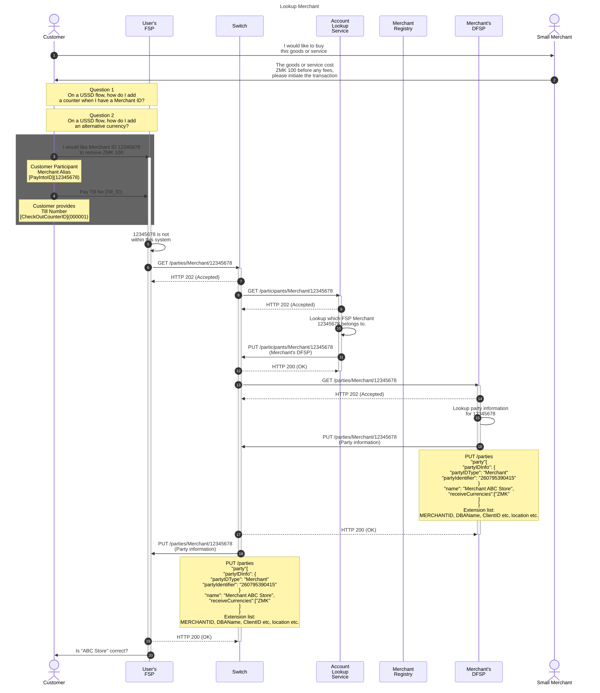
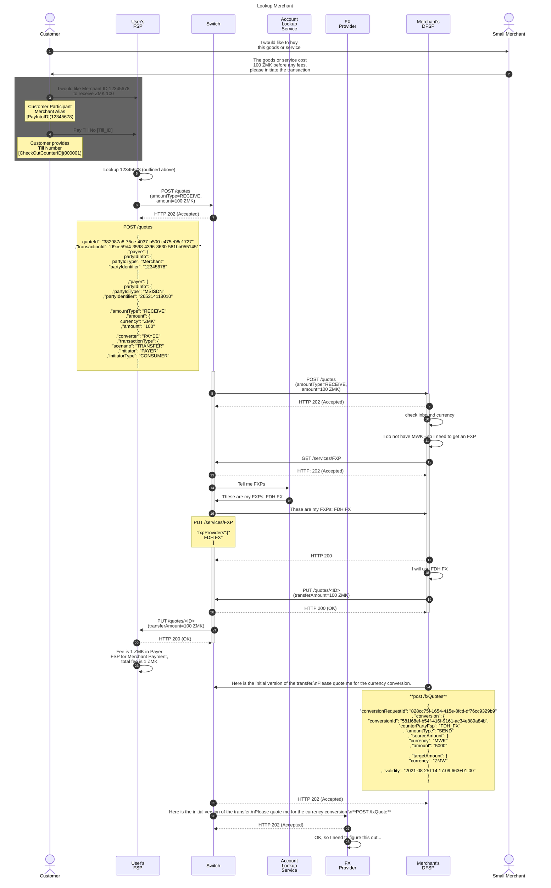

---  
sidebar_position: 2  
sidebar_label: Merchant Payment - Data
title: Data Flows for a Merchant Payment
date: 2023-07-07 09:52:28
author: Rob Reeve
description: flows for a merchant payment
tags: 
---  

## Data needed to create a record  

As we are creating a merchant, it's locations and tills, we would need to consider the following data elements

1. PayIntoID (Alias) - 12345678 (system generated or DFSP provided)
1. MerchantID (system) - 87654321 (system generated)
1. Bank Account (not capturing)
1. CheckOut Counter ID - 000001

## Simple - 1 location, 1 counter  

Data exposed by Merchant Registry
| Item | Sample Data |
|------|-------------|
| DFSP ID | 87654321 |
| MerchantID | 87654321 |
| PayIntoID (Alias) | 12345678 |
| Name of Merchant | ABC Store |
| Location | {full address} |
| MobileNumber | |

Data exposed by DFSP
| Item | Sample Data |
|------|-------------|
| PayIntoID (Alias) | 12345678 |
| Pay Into Account Number | PK23HABB12313123121132 |
| CheckOutCounterID | 000001 |
| Name of Merchant | ABC Store |
| Location | {full address} |

## Making a payment to a merchant in USSD (customer initiated)

### Finding DFSP that maintains this Merchant ID



### PUT /parties

```json
PUT /parties
"party"{
    "partyIDInfo": {
        "partyIDType": "Merchant"
        "partyIdentifier": "12345678"
        }
    "name": "Merchant ABC Store",
    "receiveCurrencies":[
        "ZMK"
        ]
    }
Extension list:
MERCHANTID, DBAName, ClientID etc, location etc.
```

### Open Questions

- What if a DFSP has more than one receive currency? In a Smart Phones, I would expect a selection, but how would this work in USSD?
- Extend that problem to consider a merchant account that can receive multiple currencies.
- In a retail transaction, a customer would see a price in a foreign currency - but we need to get that in to a USSD flow somehow, how does the consumer enter correct currency? (whatever is proposed needs to factor the above scenarios)


### Quotes



### Questions  

- I am reviewing the quotes, and currently I can only see one currency. So in the receive scenario above, the receiving DFSP would get a message saying please accept 100 ZMK. I cannot see where you would say, "but I will send in a currency you need to convert as I am sending in MWF". The receiving DFSP would say great - send it over
- On the Services FXP - are you envisioning the GET /services/FXP to include the desired currency pair (working through that some currency flows are unidirectional and some require a staging currency).
- Or do you see the response to say - FDH FX offers the following Currency Pairs and corridors
- When the Payee DFSP receives the Service response, I assume it might get quotes from all that provide the service pairs. Is that correct?

```
PayeeFSP -> PayeeFSP: Interoperable fee is 0 ZMK in<br/>Payee FSP for Merchant<br/>Payment, but 1 ZMK in<br/>internal Payee fee for Merchant
PayeeFSP ->> Switch: PUT /quotes/<ID><br/>(transferAmount=100 ZMK)
Switch -->> PayeeFSP: HTTP 200 (OK)
deactivate PayeeFSP
Switch ->> PayerFSP: PUT /quotes/<ID><br/>(transferAmount=100 ZMK)
PayerFSP -->> Switch: HTTP 200 (OK)
deactivate Switch
PayerFSP -> PayerFSP: Fee is 1 ZMK in Payer<br/>FSP for Merchant Payment,<br/>total fee is 1 ZMK
PayerFSP->>cust: Will you approve Merchant Payment<br/>of 100 ZMK to Payee? It will<br/>cost you 1 ZMK in fees.
deactivate PayerFSP
cust ->> PayerFSP: Perform transaction
activate PayerFSP
PayerFSP -> PayerFSP: Reserve 101 ZMK from Payer<br/>account, 100 ZMK to Switch<br/>account and 1 ZMK to<br/>fee account
PayerFSP ->> Switch: POST /transfers<br/>(amount=100 ZMK)
activate Switch
Switch -->> PayerFSP: HTTP 202 (Accepted)
Switch -> Switch: Reserve 100 ZMK from Payer FSP<br/>account to Payee FSP account
Switch ->> PayeeFSP: POST /transfers<br/>(amount=100 ZMK)
activate PayeeFSP
PayeeFSP --> Switch: HTTP 202 (Accepted)
PayeeFSP -> PayeeFSP: Transfer 100 ZMK from Switch<br/>account to Payee account, 1 ZMK<br/>from Payee to fee account
PayeeFSP -> Payee: You have received 100 ZMK<br/>from Payer and paid 1 ZMK<br/>in internal fee. Please give<br/>goods or service to Payer.
Payee ->> cust: Here are your goods or services
PayeeFSP ->> Switch: PUT /transfers/<ID>
Switch -->> PayeeFSP: HTTP 200 (OK)
deactivate PayeeFSP
Switch -> Switch: Commit reserved transfer
Switch ->> PayerFSP: PUT /transfers/<ID>
PayerFSP -->> Switch: HTTP 200 (OK)
deactivate Switch
PayerFSP -> PayerFSP: Commit reserved transfer
PayerFSP ->> cust : Payment successful, you<br/>have paid 100 ZMK to Payee<br/>plus 1 ZMK in fees
deactivate PayerFSP

```

### POST /quotes

Currently the message body does not tell me the sending currency

```json
POST /quotes

{
    quoteId": "382987a8-75ce-4037-b500-c475e08c1727"
    ,"transactionId": "d9ce59d4-3598-4396-8630-581bb0551451"
    ,"payee": {
        partyIdInfo": {
            partyIdType": "Merchant"
            "partyIdentifier": "12345678"
        }
    }
    ,"payer": {
        partyIdInfo": {
            ,"partyIdType": "MSISDN"
            ,"partyIdentifier": "265314118010"
        }
    }
    ,"amountType": "RECEIVE"
    ,"amount": {
        currency": "ZMK"
        ,"amount": "100"
    }
    ,"converter": "PAYEE"
    ,"transactionType": {
        "scenario": "TRANSFER"
        ,"initiator": "PAYER"
        ,"initiatorType": "CONSUMER"
    }
}
```

### PUT /services/FXP

```json
PUT /services/FXP

"fxpProviders":["
FDH FX"
]
```

### post /fxQuotes

```json
    {
    "conversionRequestId": "828cc75f-1654-415e-8fcd-df76cc9329b9"
    , "conversion": {
        "conversionId": "581f68ef-b54f-416f-9161-ac34e889a84b",
        , "counterPartyFsp": "FDH_FX"
        , "amountType": "SEND"
        , "sourceAmount": {
            "currency": "MWK"
            , "amount": "5000"
        }
        , "targetAmount": {
            "currency": "ZMW"
        }
        , "validity": "2021-08-25T14:17:09.663+01:00"
    }
    }
```
## Other text

```nano
PAYINTOID  -->  PAYINTOID, MERCHANTID, DFSPID
PayerFSP -> ALS - MerchantRegistry ---> 12345678       (12345678,87654321, DFSP-A)

GET /parties  (PAYINTOID, Extension Data ?)
-------------------------------------------
PayerFSP -> MOJALOOP --> DFSPA   (PayintoID --> ClientID, Name of Store (PayeeInfo) )

QUOTE

TRANSFER
PayerFSP -> Amount, AccountNumber, TillNumber,  (DFSP notifies the merchant about payment using TillNumber matched to CheckOutCounterID)
========================================================================================================================================

====================================================================================================================
Complex - Multi location, Multi counter  (4)  -  
 Loc 1 - Count 1,2
 Loc 2 - Count 3
 Loc 3 - Count 4
====================================================================================================================
MerchantID, PayIntoID, CheckOutCounterID, Location, MerchantContact, ClientID  
87654321, 12345677, 000001,  ABC Store, Location 1 MobileNumber              -   PK23HABB12313123121132
87654321, 12345677, 000002,  ABC Store, Location 1, MobileNumber             -   PK23HABB12313123121132
87654321, 12345678, 000003,  ABC Store, Location 2, MobileNumber             -   PK23HABB12313123121134
87654321, 12345679, 000004,  ABC Store, Location 3, MobileNumber             -   PK23HABB12313123121135

User (Customer)
--> Enter Merchant Alias: 12345678
--> Enter Till No. 000003 

GET /participants
							PAYINTOID  -->  PAYINTOID, MERCHANTID, DFSPID
PayerFSP -> ALS - MerchantRegistry ---> 12345678       (12345678,87654321, DFSP-A)

GET /parties  (PAYINTOID, Extension Data ?)
-------------------------------------------
PayerFSP -> MOJALOOP --> DFSPA   (PayintoID --> IBAN/AccountNumber, Name of Store (PayeeInfo) )

QUOTE

TRANSFER
PayerFSP -> Amount, AccountNumber, TillNumber,  (DFSP notifies the merchant about payment using TillNumber matched to CheckOutCounterID)
========================================================================================================================================
```