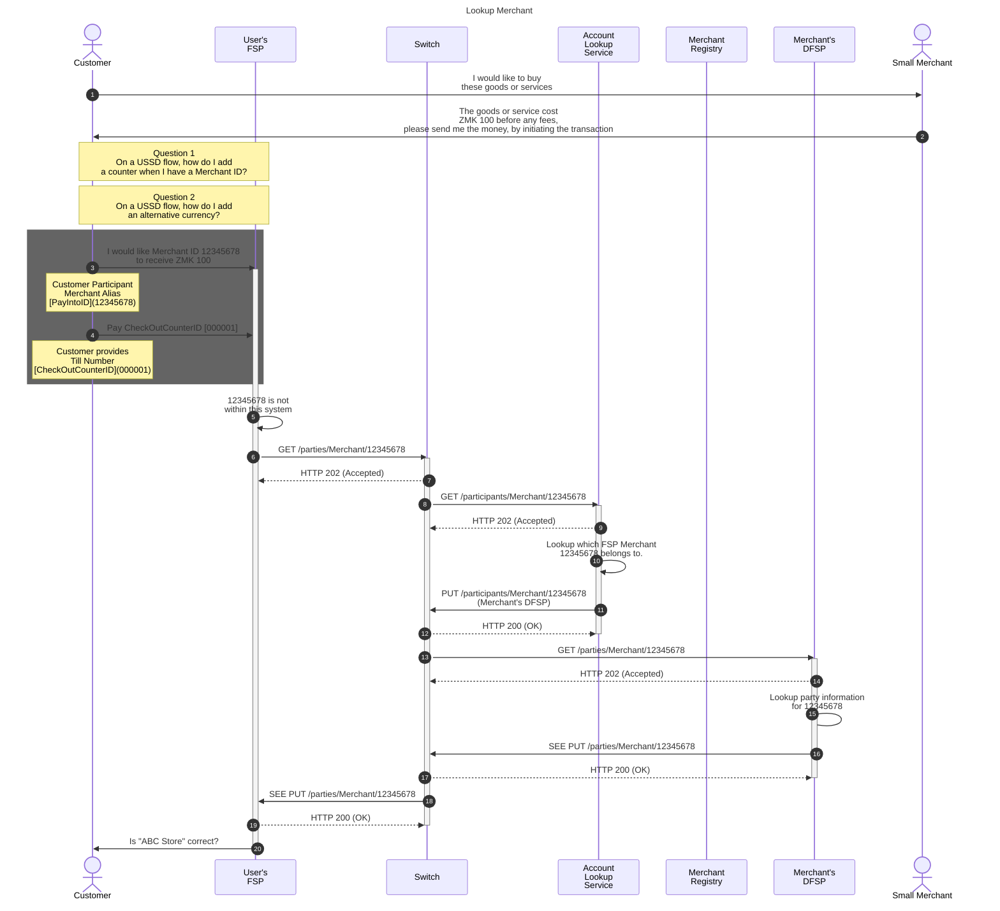
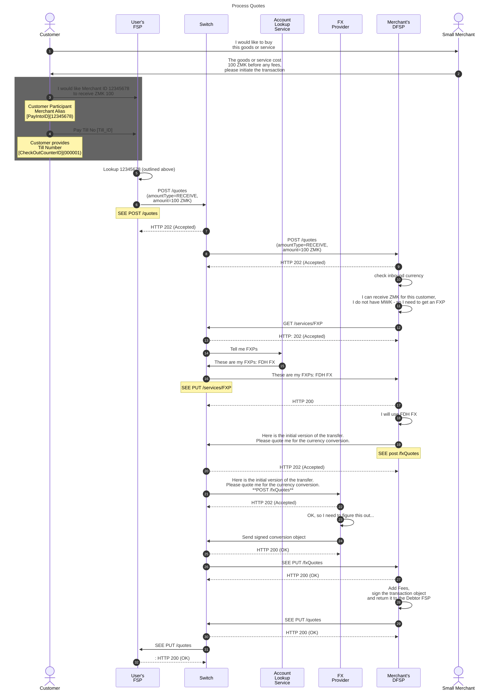
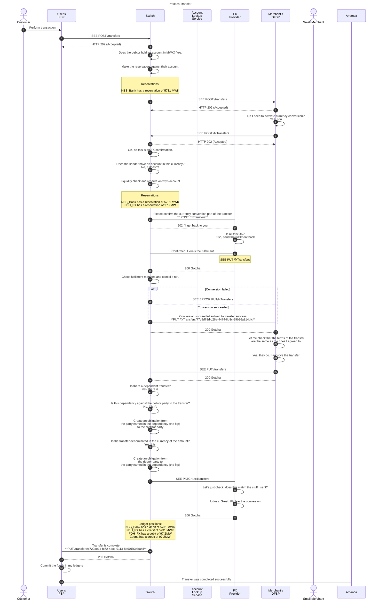

---  
sidebar_position: 2  
sidebar_label: Merchant Payment - Data
title: Data Flows for a Merchant Payment
date: 2023-07-07 09:52:28
author: Rob Reeve
description: flows for a merchant payment
tags: 
---  

## Making a payment to a merchant via USSD (customer initiated)

In the following scenario, we are going to test the boundaries a little, by assuming that the Payment to the merchant will be from a user in one country to a merchant in another country. We provide the data that is needed below and the sequence and the flow of information between the various parties.

The design currently assumes each party has an account identifier that only maps to a single currency. Further design would be required to support an identifier that maps to multiple currencies and any potential resolution that might be required. The receiving DFSP will initiate the conversion of the foreign exchange currency (equally this could be facilitated by the paying DFSP, but this will be explored later).

## Data needed to create a record  

As we are creating a merchant, it's locations and tills, we would need to consider the following data elements

1. PayIntoID (Alias) - 12345678 (system generated or DFSP provided)
1. MerchantID (system) - 87654321 (system generated)
1. Bank Account (not capturing)
1. CheckOut Counter ID - 000001

## Simple - 1 location, 1 counter  

We will assume our customer is in Malawi, and our merchant is in Zambia.

As the merchant will be displaying their price in the transacting currency, it will be necessary to send a "receive" request, to ensure that the merchant gets the price expected.

The transaction will be for 100 ZMK, with an exchange rate of 1 ZMK equal to 57.31 MWK.
The Merchant FSP will charge 1ZMK for the merchant transaction.

### Data exposed by Merchant Registry

| Item              | Sample Data    |
| ----------------- | -------------- |
| DFSP ID           | DFSP2          |
| MerchantID        | 87654321       |
| PayIntoID (Alias) | 12345678       |
| Name of Merchant  | ABC Store      |
| Location          | {full address} |
| MobileNumber      |                |

### Data exposed by Payee DFSP

| Item                    | Sample Data            |
| ----------------------- | ---------------------- |
| PayIntoID (Alias)       | 12345678               |
| Pay Into Account Number | PK23HABB12313123121132 |
| CheckOutCounterID       | 000001                 |
| Name of Merchant        | ABC Store              |
| Location                | {full address}         |

### Finding DFSP that maintains this Merchant ID



### PUT /parties/Merchant

```json
PUT /parties
"party"{
    "partyIDInfo": {
        "partyIDType": "Merchant"
        "partyIdentifier": "12345678"
        }
    "name": "ABC Store",
    "receiveCurrencies":[
        "ZMK"
        ]
    "extensionlist": {
        "merchantID": "87654321"
        ,"DBAName": "ABC Store"
        ,"AccountID": "PK23HABB12313123121132"
        ,"location": "{full address}"}

    }
```

### Open Questions

- What if a DFSP has more than one receive currency? In a Smart Phones, I would expect a selection, but how would this work in USSD?
- Extend that problem to consider a merchant account that can receive multiple currencies.
- In a retail transaction, a customer would see a price in a foreign currency - but we need to get that in to a USSD flow somehow, how does the consumer enter correct currency? (whatever is proposed needs to factor the above scenarios)

### Quotes



#### Commentary

During the FX Quote, the FXP can add a fee, they will then set an expiry time and sign the quotation object, create an ILPV4 prepare packet and return it in the intermediary object.

> :exclamation: NOTE: the ILPV4 prepare packet contains the following items, all encoded:  
>  
> - The amount being sent (i.e. in the source currency)  
> - An expiry time  
> - The condition  
> - The name of the fxp  
> - The content of the conversion terms  


### Questions  

- I am reviewing the quotes, and currently I can only see one currency. So in the receive scenario above, the receiving DFSP would get a message saying please accept 100 ZMK. I cannot see where you would say, "but I will send in a currency you need to convert as I am sending in MWF". The receiving DFSP would say great - send it over
- On the Services FXP - are you envisioning the GET /services/FXP to include the desired currency pair (working through that some currency flows are unidirectional and some require a staging currency).
- Or do you see the response to say - FDH FX offers the following Currency Pairs and corridors
- When the Payee DFSP receives the Service response, I assume it might get quotes from all that provide the service pairs. Is that correct?

I see we have a POST fxQuote but a PUT fxQuotes - should they not be the same?

```nano
PayeeFSP -> PayeeFSP: Interoperable fee is 0 ZMK in<br/>Payee FSP for Merchant<br/>Payment, but 1 ZMK in<br/>internal Payee fee for Merchant
PayeeFSP ->> Switch: PUT /quotes/<ID><br/>(transferAmount=100 ZMK)
Switch -->> PayeeFSP: HTTP 200 (OK)
deactivate PayeeFSP
Switch ->> PayerFSP: PUT /quotes/<ID><br/>(transferAmount=100 ZMK)
PayerFSP -->> Switch: HTTP 200 (OK)
deactivate Switch
PayerFSP -> PayerFSP: Fee is 1 ZMK in Payer<br/>FSP for Merchant Payment,<br/>total fee is 1 ZMK
PayerFSP->>cust: Will you approve Merchant Payment<br/>of 100 ZMK to Payee? It will<br/>cost you 1 ZMK in fees.
deactivate PayerFSP

```


### PUT /services/FXP

```json
PUT /services/FXP

"fxpProviders":[
    "FDH FX"
    ]
```

### POST /fxQuotes

```json
    {
    "conversionRequestId": "828cc75f-1654-415e-8fcd-df76cc9329b9"
    , "conversion": {
        "conversionId": "581f68ef-b54f-416f-9161-ac34e889a84b"
        , "counterPartyFsp": "FX Provider"
        , "amountType": "RECEIVE"
        , "sourceAmount": {
            "currency": "MWK",
            "amount": "5731"
            }
        , "targetAmount": {
            "currency": "ZMW"
            }
        , "validity": "2021-08-25T14:17:09.663+01:00"
        }
    }
```

### PUT /fxQuotes  

```json
    PUT /fxQuotes/828cc75f-1654-415e-8fcd-df76cc9329b9

    {
        "condition": "bdbcf517cfc7e474392935781cc14043602e53dc2e8e8452826c5241dfd5e7ab"
        , "conversionTerms": {
            "conversionId": "581f68ef-b54f-416f-9161-ac34e889a84b"
            , "initiatingFsp": "User's FSP"
            , "sourceAmount": {
                "currency": "MWK",
                "amount": "5731"
            }
            , "targetAmount": {
                "currency": "ZMW",
                "amount": "100"
            }
            , "charges": [
                {
                    "chargeType": "Conversion fee"
                    , "sourceAmount": {
                        "currency": "MWK"
                        , "amount": "172"
                    }
                    , "targetAmount": {
                        "currency": "ZMW"
                        , "amount": "3"
                    }
                }
            ]
        }
    }
```

### PUT /quotes  


```json
put /quotes/382987a8-75ce-4037-b500-c475e08c1727

{
    "transferAmount": {
        "currency": "MWS"
        , "amount": "5731"
    }
    , "payeeReceiveAmount": {
        "currency": "ZMW"
        , "amount": "95"
    },
    "payeeFspFee": {
        "currency": "ZMW"
        , "amount": "5"
    }
    , "expiration": "2021-08-25T14:17:09.663+01:00"
    , "ilpPacket:" {
        "transactionId": "d9ce59d4-3598-4396-8630-581bb0551451"
        , "quoteId": "382987a8-75ce-4037-b500-c475e08c1727"
        , "payee": {
            "partyIdInfo": {
            "partyIdType": "MSISDN"
            , "partyIdentifier": "260795390415"
            }
        }
        , "payer": {
            "partyIdInfo": {
                "partyIdType": "MERCHANT"
                , "partyIdentifier": "87654321"
            }
        }
        , "amount": {
            "currency": "MWK"
            , "amount": "5731"
        }
        , "dependents":[
            {
                "intermediary": "FDH_FX"
                , "condition": "bdbcf517cfc7e474392935781cc14043602e53dc2e8e8452826c5241dfd5e7ab"
            }
        ]
        , "transactionType": {
            "scenario": "TRANSFER"
            , "initiator": "PAYER"
            , "initiatorType": "CONSUMER"
        }
    }
        , "condition": "BfNFPRgfKF8Ke9kpoNAagmcI4/Hya5o/rq9/fq97ZiA="
    }


```

## Transfer




### Comments

Check the legacy double entry for the reservations - something feels wrong

### POST /transfers

```json
POST /transfers

    {
        "transferId": "c720ae14-fc72-4acd-9113-8b601b34ba4d"
        , "payeeFsp": "Zoona"
        , "payerFsp": "NBS_Bank"
        , "amount": {
            "currency": "MWK"
            , "amount": "5731"
        }
        , "transaction": {
            "transactionId": "d9ce59d4-3598-4396-8630-581bb0551451"
            , "quoteId": "382987a8-75ce-4037-b500-c475e08c1727"
            , "payee": {
                "fspId": "Zoona"
                , "partyIdInfo": {
                    "partyIdType": "MSISDN"
                    , "partyIdentifier": "260795390415"
                    }
            }
        }
        , "payer": {
             "fspId": "NBS_Bank"
            , "partyIdInfo": {
                "partyIdType": "MSISDN"
                , "partyIdentifier": "265314118010"
            }
        }
        , "dependents":[
            {
                "intermediary": "FDH_FX"
                , "condition": "bdbcf517cfc7e474392935781cc14043602e53dc2e8e8452826c5241dfd5e7ab"
            }
        ]
    }

```

### POST /fxTransfers

```json
POST /fxTransfers

    {
        "commitRequestId": "77c9d78d-c26a-4474-8b3c-99b96a814bfc"
        , "relatedTransactionId": "d9ce59d4-3598-4396-8630-581bb0551451"
        , "requestingFsp": "Zoona"
        , "respondingfxp": "FDH_FX"
        , "sourceAmount": {
            "currency": "MWK",
            "amount": "5731"
        }
        , "targetAmount": {
            "currency": "ZMW",
            "amount": "97"
        }
        , "condition": "bdbcf517cfc7e474392935781cc14043602e53dc2e8e8452826c5241dfd5e7ab"
    }
```

### PUT /fxTransfers

```JSON
**PUT /fxTransfers/77c9d78d-c26a-4474-8b3c-99b96a814bfc**

{
    "fulfilment": "188909ceb6cd5c35d5c6b394f0a9e5a0571199c332fbd013dc1e6b8a2d5fff42"
    , "completedTimeStamp": "2021-08-25T14:17:08.175+01:00"
    , "conversionState": "RESERVED"
}
```

```JSON
PUT /fxTransfers/77c9d78d-c26a-4474-8b3c-99b96a814bfc/error

{
    "errorCode": "9999"
    , "errorDescription": "Whatever the error was"
}
```

### PUT /transfers

```JSON  
PUT /transfers/c720ae14-fc72-4acd-9113-8b601b34ba4d

{
    "fulfilment": "mhPUT9ZAwd-BXLfeSd7-YPh46rBWRNBiTCSWjpku90s"
    , "completedTimestamp": "2021-08-25T14:17:08.227+01:00"
    , "transferState": "COMMITTED"
}
```

### PATCH /fxTransfers

The transfer succeeded.
You can clear it in your ledgers

```JSON
**PATCH /fxTransfers/77c9d78d-c26a-4474-8b3c-99b96a814bfc**

{
    "fulfilment": "2e6870fb4eda9c2a29ecf376ceb5b05c"
    , "completedTimeStamp": "2021-08-25T14:17:08.175+01:00"
    , "conversionState": "COMMITTED"
}
```

## Other text

```nano
PAYINTOID  -->  PAYINTOID, MERCHANTID, DFSPID
PayerFSP -> ALS - MerchantRegistry ---> 12345678       (12345678,87654321, DFSP-A)

GET /parties  (PAYINTOID, Extension Data ?)
-------------------------------------------
PayerFSP -> MOJALOOP --> DFSPA   (PayintoID --> ClientID, Name of Store (PayeeInfo) )

QUOTE

TRANSFER
PayerFSP -> Amount, AccountNumber, TillNumber,  (DFSP notifies the merchant about payment using TillNumber matched to CheckOutCounterID)
========================================================================================================================================

====================================================================================================================
Complex - Multi location, Multi counter  (4)  -  
 Loc 1 - Count 1,2
 Loc 2 - Count 3
 Loc 3 - Count 4
====================================================================================================================
MerchantID, PayIntoID, CheckOutCounterID, Location, MerchantContact, ClientID  
87654321, 12345677, 000001,  ABC Store, Location 1 MobileNumber              -   PK23HABB12313123121132
87654321, 12345677, 000002,  ABC Store, Location 1, MobileNumber             -   PK23HABB12313123121132
87654321, 12345678, 000003,  ABC Store, Location 2, MobileNumber             -   PK23HABB12313123121134
87654321, 12345679, 000004,  ABC Store, Location 3, MobileNumber             -   PK23HABB12313123121135

User (Customer)
--> Enter Merchant Alias: 12345678
--> Enter Till No. 000003 

GET /participants
							PAYINTOID  -->  PAYINTOID, MERCHANTID, DFSPID
PayerFSP -> ALS - MerchantRegistry ---> 12345678       (12345678,87654321, DFSP-A)

GET /parties  (PAYINTOID, Extension Data ?)
-------------------------------------------
PayerFSP -> MOJALOOP --> DFSPA   (PayintoID --> IBAN/AccountNumber, Name of Store (PayeeInfo) )

QUOTE

TRANSFER
PayerFSP -> Amount, AccountNumber, TillNumber,  (DFSP notifies the merchant about payment using TillNumber matched to CheckOutCounterID)
========================================================================================================================================
```