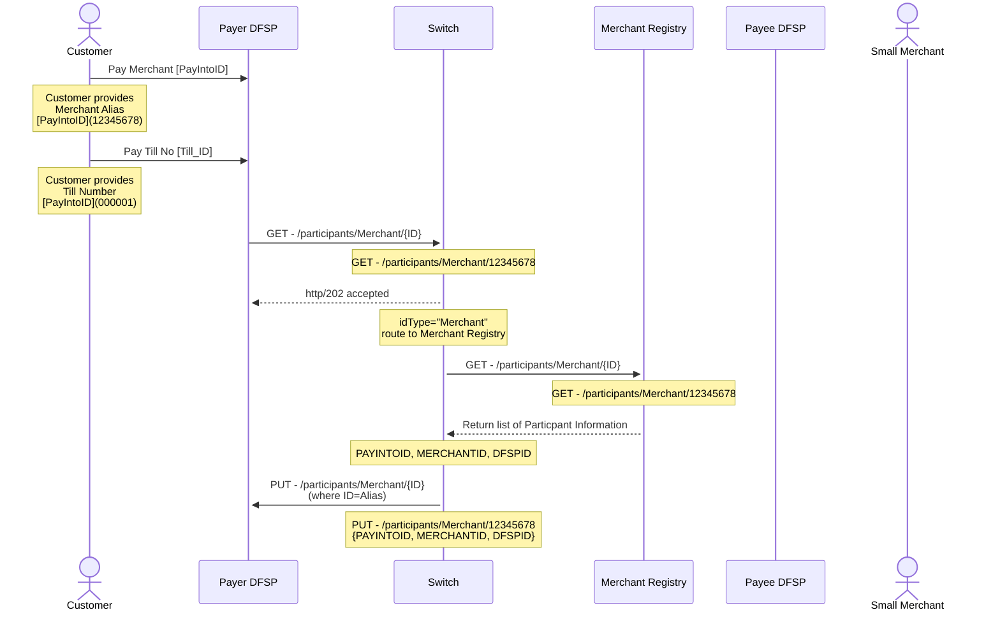

## Data needed to create a record  

As we are creating a merchant, it's locations and tills, we would need to consider the following data elements

1. PayIntoID (Alias) - 12345678 (system generated or DFSP provided)
1. MerchantID (system) - 87654321 (system generated)
1. Bank Account (not capturing)
1. CheckOut Counter ID - 000001

## Simple - 1 location, 1 counter  

Data held at Merchant Registry
| Item | Sample Data |
|------|-------------|
| DFSP ID | 87654321 |
| MerchantID | 87654321 |
| PayIntoID (Alias) | 12345678 |
| Name of Merchant | ABC Store |
| Location | {full address} |
| MobileNumber | |

Data held at DFSP
| Item | Sample Data |
|------|-------------|
| PayIntoID (Alias) | 12345678 |
| Pay Into Account Number | PK23HABB12313123121132 |
| CheckOutCounterID | 000001 |
| Name of Merchant | ABC Store |
| Location | {full address} |

## Making a payment to a merchant in USSD



```
PAYINTOID  -->  PAYINTOID, MERCHANTID, DFSPID
PayerFSP -> ALS - MerchantRegistry ---> 12345678       (12345678,87654321, DFSP-A)

GET /parties  (PAYINTOID, Extension Data ?)
-------------------------------------------
PayerFSP -> MOJALOOP --> DFSPA   (PayintoID --> ClientID, Name of Store (PayeeInfo) )

QUOTE

TRANSFER
PayerFSP -> Amount, AccountNumber, TillNumber,  (DFSP notifies the merchant about payment using TillNumber matched to CheckOutCounterID)
========================================================================================================================================

====================================================================================================================
Complex - Multi location, Multi counter  (4)  -  
 Loc 1 - Count 1,2
 Loc 2 - Count 3
 Loc 3 - Count 4
====================================================================================================================
MerchantID, PayIntoID, CheckOutCounterID, Location, MerchantContact, ClientID  
87654321, 12345677, 000001,  ABC Store, Location 1 MobileNumber              -   PK23HABB12313123121132
87654321, 12345677, 000002,  ABC Store, Location 1, MobileNumber             -   PK23HABB12313123121132
87654321, 12345678, 000003,  ABC Store, Location 2, MobileNumber             -   PK23HABB12313123121134
87654321, 12345679, 000004,  ABC Store, Location 3, MobileNumber             -   PK23HABB12313123121135

User (Customer)
--> Enter Merchant Alias: 12345678
--> Enter Till No. 000003 

GET /participants
							PAYINTOID  -->  PAYINTOID, MERCHANTID, DFSPID
PayerFSP -> ALS - MerchantRegistry ---> 12345678       (12345678,87654321, DFSP-A)

GET /parties  (PAYINTOID, Extension Data ?)
-------------------------------------------
PayerFSP -> MOJALOOP --> DFSPA   (PayintoID --> IBAN/AccountNumber, Name of Store (PayeeInfo) )

QUOTE

TRANSFER
PayerFSP -> Amount, AccountNumber, TillNumber,  (DFSP notifies the merchant about payment using TillNumber matched to CheckOutCounterID)
========================================================================================================================================
```